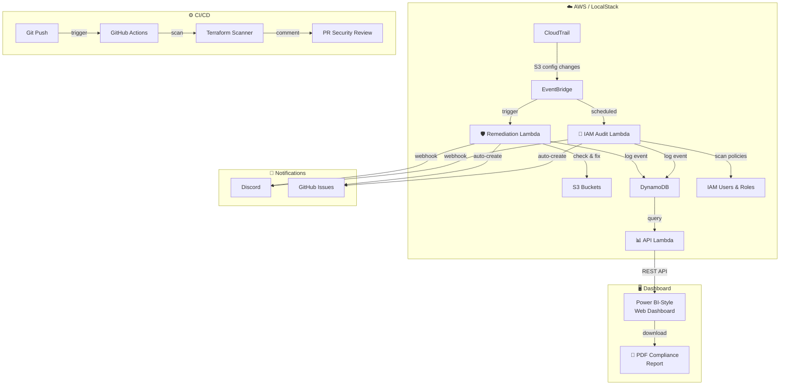

# 🛡️ Serverless CSPM — Cloud Security Posture Management

[](https://github.com/PranavN2012/CPSM_Project)
[](https://python.org)
[](https://terraform.io)
[](https://localstack.cloud)

An **event-driven, serverless** Cloud Security Posture Management tool that automatically detects and remediates AWS security misconfigurations in real-time.

---

## 🏗️ Architecture



## 🔍 Vulnerability Detection

| # | Vulnerability | Detection | Remediation | Severity | Compliance |
|---|---|---|---|---|---|
| 1 | **S3 Public Access** | Buckets with public access block disabled | ✅ Auto-fix (enables all 4 block flags) | CRITICAL | CIS 2.1.5, PCI-DSS 2.2 |
| 2 | **S3 Encryption** | Buckets without default server-side encryption | ✅ Auto-fix (enables AES-256) | HIGH | CIS 2.1.1, SOC2 CC6.1 |
| 3 | **IAM Overpermissive** | Users/Roles with wildcard `*` permissions | ⚠️ Flags only (manual fix required) | CRITICAL | CIS 1.16, PCI-DSS 7.1 |

## ✨ Features

- **Real-time remediation** — Event-driven via EventBridge, not periodic scanning
- **Multi-vulnerability** — 3 vulnerability types with auto-remediation
- **Compliance mapping** — CIS AWS Benchmarks, SOC 2, PCI-DSS frameworks
- **Power BI dashboard** — KPI cards, Chart.js visualizations, severity badges
- **PDF compliance reports** — Downloadable executive summary with risk scores
- **CI/CD shift-left** — GitHub Actions scans Terraform before deployment
- **Discord & GitHub** — Real-time notifications and auto-created Issues
- **Historical trending** — Compliance score tracking over time
- **100% local** — Runs entirely on LocalStack (no AWS account needed)
- **Infrastructure as Code** — Full Terraform deployment

## 🛠️ Tech Stack

| Layer | Technology |
|---|---|
| Compute | AWS Lambda (Python 3.11) |
| Storage | DynamoDB, S3 |
| Orchestration | EventBridge |
| IaC | Terraform |
| Frontend | HTML5, CSS3, JavaScript, Chart.js |
| Reports | fpdf2 (PDF generation) |
| CI/CD | GitHub Actions |
| Notifications | Discord Webhooks, GitHub API |
| Local Dev | LocalStack, Docker |

## 🚀 Quick Start

```bash
# 1. Clone and enter
git clone https://github.com/PranavN2012/CPSM_Project.git
cd CPSM_Project

# 2. Start LocalStack
docker-compose up -d

# 3. Deploy Lambda functions
python scripts/deploy-lambdas.py

# 4. Start the dashboard
python scripts/local-api-server.py

# 5. Open http://localhost:3000

# 6. Simulate attacks (in another terminal)
python scripts/simulate-attacks.py
```

## 📁 Project Structure

```
serverless-cspm/
├── lambda/
│   ├── remediation/          # S3 public access + encryption remediation
│   ├── iam-audit/            # IAM wildcard policy scanner
│   ├── api/                  # Dashboard REST API
│   └── shared/               # Compliance mapping, GitHub notifier
├── frontend/
│   ├── index.html            # Power BI-style dashboard
│   ├── style.css             # Microsoft Fabric theme
│   └── app.js                # Chart.js + real-time updates
├── terraform/                # Infrastructure as Code
├── scripts/
│   ├── local-api-server.py   # All-in-one local server
│   ├── deploy-lambdas.py     # Direct Lambda deployment
│   ├── simulate-attacks.py   # Multi-vulnerability attack simulator
│   ├── report_generator.py   # PDF compliance report
│   └── terraform-scanner.py  # IaC security scanner
├── tests/                    # pytest unit tests
├── .github/workflows/        # CI/CD pipeline
└── docker-compose.yml        # LocalStack config
```

## 🧪 Running Tests

```bash
pip install pytest
pytest tests/ -v
```

## 📄 License

MIT
